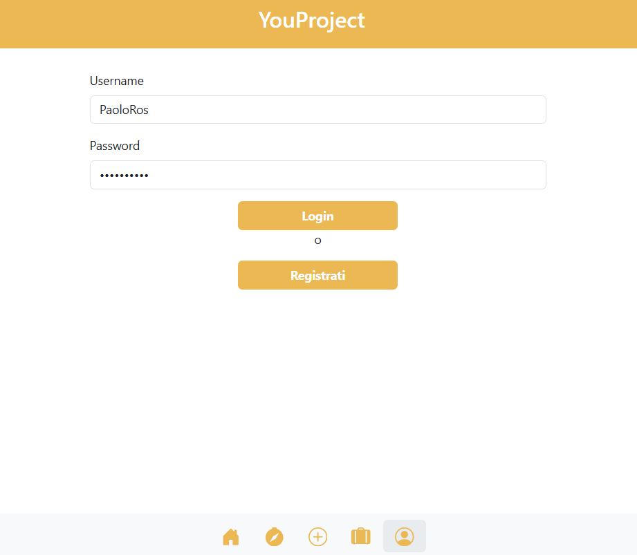
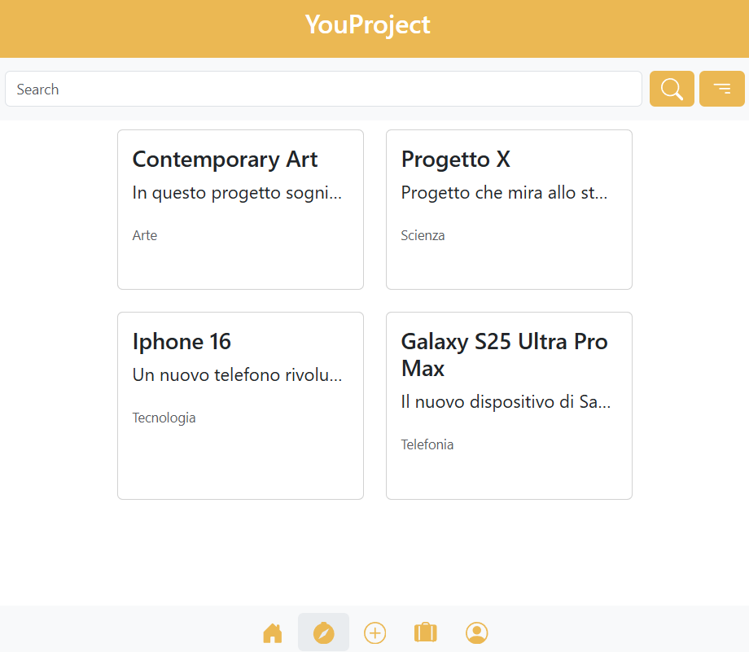

# YouProject-presentation

## Introduction

YouProject is a university project created with the aim of learning and implementing modern technologies such as **Node.js**, **React**, and **MongoDB**. This project is for educational purposes only, focusing on gaining practical experience in full-stack web application development. The application provides features like user management, project creation and sharing, and news updates, simulating a collaborative environment where users can create and follow projects. I've worked in a group, so I didn't do everything.

## Key Features

- **User Management**: Registration, authentication, and profile management.
- **Project Management**: Creation, modification, and sharing of projects.
- **Collaboration**: Support projects, add collaborators, and interact through comments.
- **Project News**: Create and view news updates related to projects.
- **Project Support**: Simulate project support through donations (PayPal integration).
- **Explore Projects**: Search and explore projects that users are not yet following.

## Technologies Used

- **Frontend**:
  - React
  - Bootstrap for styling and icons
  - Axios for handling HTTP requests
- **Backend**:
  - Node.js with Express.js
  - MongoDB for database management
  - Multer for file uploads
  - JSON Web Tokens (JWT) for authentication

## Showcase

## Requirements

- **Node.js** version 14+
- **MongoDB** (local or on MongoDB Atlas)
- **npm** version 6+

## Installation and Setup

### Clone the project

1. Clone the repository from the following [GitHub link](https://github.com/AndreaCarzeri/YouProject):
   `git clone https://github.com/AndreaCarzeri/YouProject.git`
2. Navigate to the project directory: `cd YouProject/frontend`
3. Install dependencies: `npm install`
4. Start the front end: `npm run dev`
5. Open another window and go to back-end folder: `cd backend`
6. Install dependencies: `npm install`
7. Start back-end: `npm start`

## Default Login Credentials

You can log into the application using the following default user credentials:

- **Username**: PaoloRos
- **Password**: Password1!

To protect the DB you can only read. So you can't creare account, follow projects and create new

## License

This project is licensed under the MIT License.
